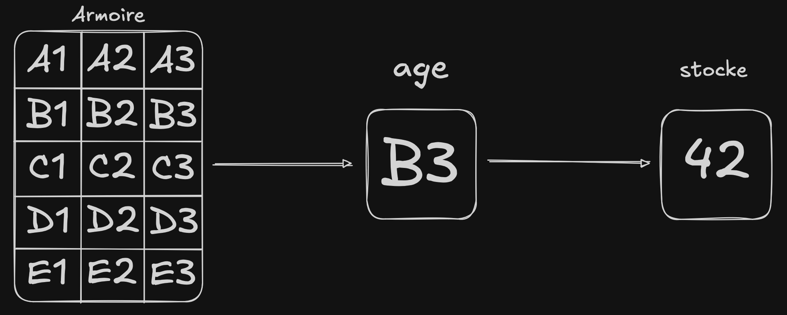
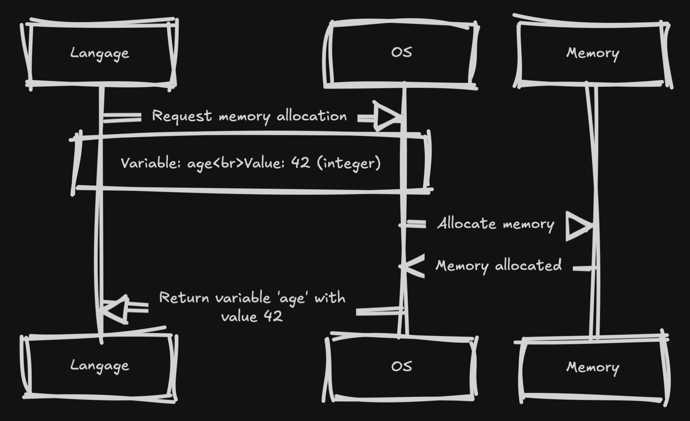
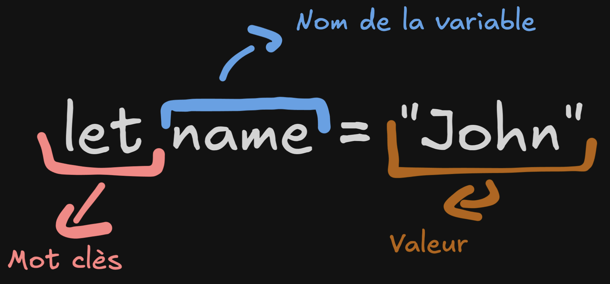
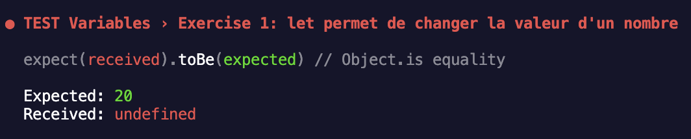
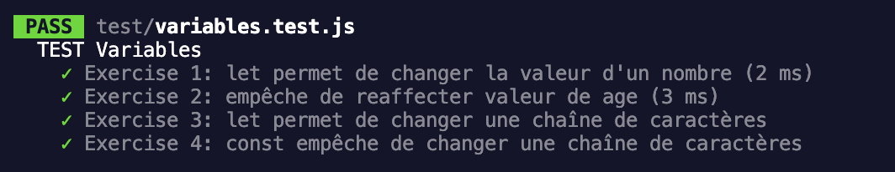

Une variable est comme une boite qui contient une quelques chose.

![images/./imagesv(images/./images)ariable_schema.png]]

Cette boite serait rangé dans une armoire avec pour chaque tirroir une adresse associé.



Dans ce schema on aurait une variable `age` qui est stocké à l'adresse `B3` et qui contient la valeur `42`.

Avec `Javascript` nous n'avons pas besoin gérer la mémoire, le moteur Javascript s'en charge pour nous ! (Et tant mieux xD)

On demande a notre ordinateur de nous donner une zone mémoire temporaire afin d'y stocker quelques une valeur.

Si on devait réaliser un schèma assez grossier, cela donnerait ca:



En Javascript, on va pouvoir stocker différents types de valeurs dans nos variables, elles sont classés en 2 catégories:

- Les primitives
- Les objects

Les valeurs primitives sont a la base du langages d'ou sont nom primitive.

- strings (chaîne de caractères)
- number (nombre)
- BigInt (très gros nombre)
- boolean (vrai ou faux)
- undefinied (non défini)
- null
- symbole

Nous rentrerons plus en détails dans les cours suivants afin que tu comprenne vraiment chaque notion qui se cache derrière ces termes.

### Mais dans tous ca, comment on declare une variable en JS ?

La syntax se compose de 3 parties (nous verrons qu'il en existe une 4ème plus tard)



### Mot clés ou `keyword`

est un mot réserver par le langage pour executer une action, par exemple: `let` permet de dire que l'on souhaite reserver un espace mémoire, que l'on pourra modifié par la suite. Liste des différents keywords en JS [`mot clés`](https://developer.mozilla.org/en-US/docs/Web/JavaScript/Reference/Lexical_grammar#keywords)

### `Nom de la variable`

Sert à différencier les variables, le nom peut être composer de caractère et chiffre, cependant les espaces ne sont pas autorisé. Il n'est pas possible d'avoir deux variables portant le même nom.

🚨 Le nom des variables est sensible à la casse.

```Javascript
let monNom = "dupont" // ✅ valide
let monnom = "dupont" // ✅ valide
let monAge = 42 // ✅ valide
let monAge = 42 // ❌ invalide, une autre variable existe avec le meme nom
let mon nom = "une erreur" // ❌ invalide, pas d'espace
```

Exemple:

```Javascript
let cat = "Garfield";
```

```Javascript
let name = "John"; // ✅ valide
let let = "async"; // ❌ invalide
const age = 42; // ✅ valide

var address = "127.0.0.1" // ✅ valide
```

### `let`

Avec `let` tu peux déclarer une variable dans laquelle tu peux changer sa valeur !
C'est à dire que son contenue peu changer !

```Javascript
let name = "Alexis"

name = "Valentin"  // ✅ valide
```

### `const`

C'est un autre moyen de déclarer des variables, const est le diminutif de constante (qui ne change pas). Il n'est donc pas possible de modifier la valeur qui y est associé.

```javascript
const name = "Alexis";
name = "Valentin"; // ❌ invalide
```

### `var` (déprécié)

Tu verras peut-être des variables déclarer avec le mot clés `var` mais il n'est plus recommendé de l'utiliser.

Mais il avait la meme utilisation que `let`.

---

🚨 ATTENTION 🚨

Une variable qui n'aurait pas été initialisé à sa création à quand même une valeur !
C'est valeur en `Javascript` est `undefined`

```Javascript
let name;

console.log(name); // output: undefined
```

une const doit toujours avoir une valeur de départ. Si jamais tu oublies, tu verras un jolie message d'erreur

```Javascript
const name; // ❌ erreur
```

---

### **Un peu de pratique 💪**

Vérifie que tu sois sure la bonne branch, dans ton terminal saisie la commande:

```bash
git status // On branch 1-Variables ✅
# pour changer de branches
git reset --hard HEAD && git switch 1-Variables
```

1️⃣ Utilise let pour changer la valeur d'un nombre
2️⃣ Empêche la variable de changer de valeur
3️⃣ Change la valeur de message pour mettre "Au revoir"
4️⃣ Trouve l'erreur dans ce code

Pour tester si tes réponses sont bonnes, tu peux exécuter la commande suivante:

```bash
npm run test
```

Les tests sont relancés dès que tu sauvegardes ton fichiers.


Explication:

- TEST Variables > Exercice 1: L'exercice qui ne valide pas le test
- Expected / Received: On te montre que l'erreur vient de la valeur reçue


Lorsque les tests sont tous vert tu peux passer au cours suivant !

---

### Prochain cours : Les numbers 🚀

tu peux maintenant passer au cours suivant !

```shell
git reset --hard HEAD
git switch 2-Numbers
```
