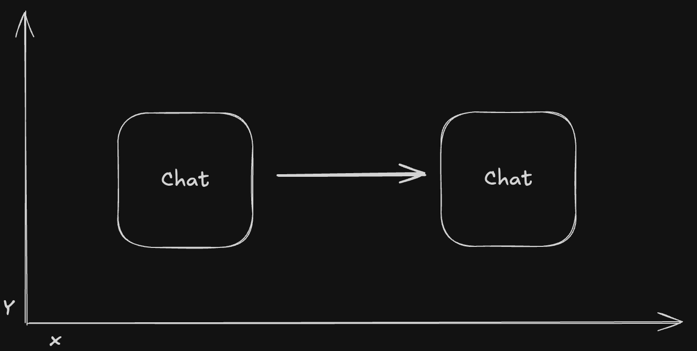

# Les objets en JavaScript

## **Qu'est-ce qu'un objet ?**

Un objet est une structure de données qui permet de stocker des informations sous forme de **paires clé/valeur**.

```javascript
const chat = {
  name: "Garfield",
};
```

Dans cet exemple :

- `name` → **clé** qui permet d'accéder à sa valeur
- `"Garfield"` → **valeur** associée à la clé `name`

---

## **Comment accéder aux propriétés d’un objet ?**

Il existe **deux notations** pour accéder aux valeurs d’un objet :

### Dot notation (`.`)

Utilisée lorsque l'on **connaît** la clé à l'avance.

```javascript
const data = { name: "John" };
console.log(data.name); // "John"
```

### Bracket notation (`[]`)

Utile lorsque la clé est **dynamique** (exemple : une variable)

```javascript
const data = { name: "John" };
console.log(data["name"]); // "John"
```

---

## **Types de valeurs stockables**

Un objet peut contenir **tous** les types de valeurs **JavaScript** :

- `Number`
- `String`
- `BigInt`
- `Boolean`
- `undefined`
- `null`
- `function`

Exemple d’un objet contenant différents types de valeurs :

```javascript
const chat = {
  name: "Tano",
  age: 2.5,
  isSterilized: false,
  jump: () => {
    console.log("Je saute !");
  },
  walk: (direction) => {
    console.log(`je marche en direction de ${direction}`);
  },
};
```

Dans cet exemple :

- `name`, `age`, `isSterilized` sont des **attributs** (propriétés)
- `jump`, `walk` sont des **méthodes** (fonctions attachées à l'objet)

---

## **Attributs et méthodes**

## Attributs

Un attribut est une **propriété intrinsèque** à un objet.

> Si nous avions plusieurs chats, **chacun aurait son propre nom et âge**.

## Méthodes

Les méthodes sont des **actions** associées à un objet. Elles permettent **de modifier ses attributs**

💡 **Pour modifier un attribut depuis une méthode, on utilise `this`**.

> 🚨 **Attention** : Ne fonctionne pas dans les fonctions fléchées (arrow functions).

```javascript
const chat = {
  name: "Tano",
  age: 2.5,
  x: 100,
  y: 10,
  isSterilized: false,
  jump() {
    console.log("Je saute !");
  },
  walk(stepDistance) {
    this.x += stepDistance;
  },
};
```

La méthode `walk` nous permet de faire avancer notre chat sur l'axe des x d'une certaine distance.



**En javascript**:

```javascript
const chat = {
  name: "Tano",
  age: 2.5,
  x: 100,
  y: 10,
  isSterilized: false,
  jump() {
    this.y += 50;
    console.log("Je saute !");
  },
  walk(stepDistance) {
    this.x += stepDistance;
    console.log(`Je me déplace de ${stepDistance} pixels`);
  },
};

chat.walk(50);
console.log(chat.x); // 150
```

---

### 🏆 **Exercices pratiques**

#### **1️⃣ Créer un objet `user` avec les attributs suivants :**

| Clé         | Type      | Valeur par défaut |
| ----------- | --------- | ----------------- |
| `lastname`  | `string`  | `'Doe'`           |
| `firstname` | `string`  | `'John'`          |
| `email`     | `string`  | `'john@doe.fr'`   |
| `phone`     | `string`  | `'0000000000'`    |
| `isLogged`  | `boolean` | `false`           |

---

#### **2️⃣ Ajouter des méthodes à `user` :**

| Méthode                         | Action                      |
| ------------------------------- | --------------------------- |
| `updateLastname(newLastname)`   | Modifie `lastname`          |
| `updateFirstname(newFirstname)` | Modifie `firstname`         |
| `signIn()`                      | Change `isLogged` à `true`  |
| `logout()`                      | Change `isLogged` à `false` |

---

## **Déstructuration (`destructuring`)**

Depuis **ES6**, on peut extraire facilement certaines propriétés d’un objet.

Exemple **sans déstructuration** :

```javascript
const user = { firstname: "John", lastname: "Doe" };
console.log(`Bonjour ${user.firstname} ${user.lastname}`);
```

Avec **déstructuration** :

```javascript
const { firstname, lastname } = user;
console.log(`Bonjour ${firstname} ${lastname}`);
```

💡 **Attention** : Les valeurs récupérées avec `const` sont **non modifiables**.

---

## **Spread Operator (`...`)**

Le **spread operator** permet de **copier, fusionner ou modifier** des objets et des tableaux facilement.

#### ✅ **Copier un tableau ou un objet** (évite la mutation des données)

```javascript
const arr = [1, 2, 3];
const newArr = [...arr]; // Copie indépendante
console.log(newArr); // [1, 2, 3]
```

#### ✅ **Fusionner des tableaux**

```javascript
const a = [1, 2];
const b = [3, 4];
const merged = [...a, ...b];
console.log(merged); // [1, 2, 3, 4]
```

#### ✅ **Fusionner et modifier un objet**

```javascript
const user = { name: "Alice", age: 25 };
const updatedUser = { ...user, age: 26 };
console.log(updatedUser); // { name: "Alice", age: 26 }
```

#### ✅ **Passer un tableau en arguments d’une fonction**

```javascript
const numbers = [1, 2, 3];
console.log(Math.max(...numbers)); // 3
```

---

## 🏆 **Exercice 1 : Création et accès aux propriétés**

Crée un objet `car` avec les attributs suivants :

| Clé     | Type   | Valeur par défaut |
| ------- | ------ | ----------------- |
| `brand` | string | `'Tesla'`         |
| `model` | string | `'Model S'`       |
| `year`  | number | `2023`            |
| `color` | string | `'black'`         |

1️⃣ **Affiche dans la console** la marque (`brand`) et le modèle (`model`) de la voiture.  
2️⃣ **Modifie la couleur (`color`)** en `'red'` et affiche le nouvel objet.

---

## 🏆 **Exercice 2 : Ajout de méthodes**

Ajoute les **méthodes suivantes** à l'objet `car` créé précédemment :

| Méthode           | Action                                                                          |
| ----------------- | ------------------------------------------------------------------------------- |
| `paint(newColor)` | Modifie la couleur de la voiture                                                |
| `getInfo()`       | Retourne la phrase `"Cette voiture est une [brand] [model] de couleur [color]"` |

3️⃣ **Teste la méthode `paint("blue")`** et affiche le résultat.  
4️⃣ **Appelle la méthode `getInfo()`** et vérifie le message retourné.

---

## 🏆 **Exercice 3 : Gestion d'un panier d'achats**

Crée un objet `shoppingCart` contenant :

| Clé     | Type  | Valeur par défaut   |
| ------- | ----- | ------------------- |
| `items` | array | `[]` (tableau vide) |

Ajoute les **méthodes suivantes** :

| Méthode            | Action                                      |
| ------------------ | ------------------------------------------- |
| `addItem(item)`    | Ajoute un élément au panier                 |
| `removeItem(item)` | Supprime un élément s'il est dans le panier |

5️⃣ **Ajoute `'pomme'`, `'banane'` et `'chocolat'` au panier.**  
6️⃣ **Supprime `'banane'` et affiche le panier.**

---

## 🏆 **Exercice 4 : Objet avec des objets imbriqués**

Crée un objet `student` contenant un sous-objet `grades` :

```javascript
const student = {
  name: "Lucas",
  grades: {
    math: 14,
    english: 18,
    science: 12,
  },
  average: function () {
    // Complète cette méthode pour calculer la moyenne des notes
  },
};
```

9️⃣ **Complète la méthode `average()`** pour qu'elle retourne la **moyenne des notes** du student.  
🔟 **Appelle `student.average()` et affiche le résultat.**

---

### Test des exercices

```shell
npm run test
```

---

### Prochain cours : La P.O.O 🚀

tu peux maintenant passer au cours suivant !

```shell
git reset --hard HEAD
git switch 8-Poo
```
