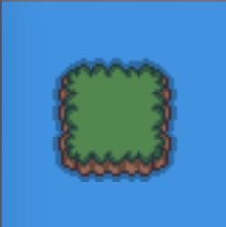

# 📝 Projet 1 : Créer une Carte de Jeu en 2D

## Avant de commencer

Nous utiliserons `vitejs`, il détecte dès que ton fichier est sauvegardé et relance la page du navigateur.

#### Rend-toi sur la branch du projet

```bash
git reset --hard HEAD
git switch project-1--build-2D-map
```

#### Installe les nouvelles librairies:

```bash
npm i
```

#### Lance `Vite`

```bash
npm run dev
```

#### Rends-toi sur ton navigateur à l'adresse suivante:

```bash
http://localhost:5173
```

## 🎯 Objectif

Dans ce projet, tu vas apprendre à **créer une carte de jeu en 2D** en utilisant **JavaScript**.  
L'idée est de **générer une grille**, où chaque case représente un élément du décor (herbe, eau, chemin, etc.).

Chaque élément sera représenté par une **image** et placé à la bonne position pour former une carte cohérente.

---

## 🛠️ Comment ça fonctionne ?

### 1. **On génère une carte sous forme de tableau**

- C’est une grille de **5 x 5 cases**.
- Chaque case contient un **chiffre** représentant un type de terrain.

Exemple d’une carte générée :

```javascript
const map = [
  1, 1, 1, 1, 1, 1, 3, 7, 4, 1, 1, 9, 0, 10, 1, 1, 5, 8, 6, 1, 1, 1, 1, 1, 1,
];
```



Ici :

- 1 représente l'eau 🌊
- 0 représente l'herbe 🌿
- 2 représente un chemin 🛤️
- 3, 4, 5, 6 sont des coins spécifiques de l’île 🏝️

### 2. **On transforme ces chiffres en images**

Chaque chiffre est associé à une image (ex : 1 devient une image d’eau).
On utilisera la fonction createImage(fichierSource, fichierSource) pour créer les images.

### 3. **On affiche la carte sur la page web**

Une fois les images générées, elles sont affichées à l’écran.

## 📌 Fonctionnalités mises à ta disposition

Tu peux utiliser ces fonctions pour t’aider :

✅ `generateMap(size)` → Crée une carte aléatoire de size x size. <br>
✅ `createImage(fichierSource, fichierSource)` → Génère une image à partir d’un fichier.<br>
✅ `displayBrowserScreen(elements, size)` → Affiche la carte sur la page web.

## À lire pour mener a bien ce projet

Lorsque l'on code, on tombe souvent sur des concepts, fonctions que l'on ne connaît pas.
En lisant la documentation, on apprend à les maîtriser.

[import](https://developer.mozilla.org/fr/docs/Web/JavaScript/Reference/Statements/import): Te permet d'utiliser les fonctions du fichier `src/helper.js`
[switch](https://developer.mozilla.org/fr/docs/Web/JavaScript/Reference/Statements/switch): À utiliser lorsque tu as plusieurs conditions qui se suivent.

## 🚀 Ce que tu dois faire

👉 Écrire une fonction qui transforme la carte en images.
👉 Retourner un tableau contenant les images dans le bon ordre.
👉 Afficher la carte avec `displayBrowserScreen()`.

## Test

Pour vérifier que tous est bien conforme au exigeance du projet
Tu peux utiliser la commande suivante:

```bash
npm run test
```
