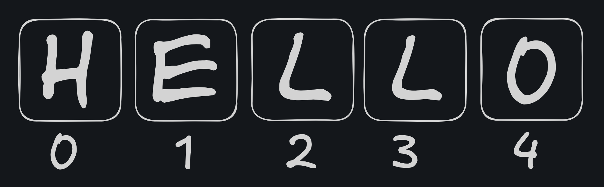

# Les strings

Une **string** représente une chaîne de caractères, que ce soit un mot, une phrase, ou même un caractère unique. Voici trois façons de déclarer une string en JavaScript :

```javascript
const name = "John"; // string avec double quote "
const dog = "robert"; // string avec simple quote
const whoAmI = `je m'appelle ${name}`; // template string avec backtick

console.log(whoAmI); // output 'je m'appelle John
```

**Exemple d'utilisation :**

```javascript
const whoAmI = "Ashx";
console.log(whoAmI); // output: Ashx
```

**Trois types de strings :**

- Double quote (`"`)
- Simple quote (`'`)
- BackTick (\`)

💡 **Note :** Il n'y a **aucune différence fonctionnelle** entre ces trois façons de déclarer une string. Cependant, les **template strings** (avec backticks) sont pratiques pour inclure des variables ou effectuer des interpolations directement dans une chaîne de caractères.

**Exemple avec une template string :**

```javascript
const sender = "Gérard";
const receiver = "Marcelle";

const message = `
	Hey ${receiver} 👋,

	Tu serais intéressé pour rejoindre une super formation ?

	Bien à toi,
	${sender}
`;
```

---

**Convertir une valeur en string**
Pour transformer une valeur en string, vous pouvez utiliser la fonction `String()` :

```javascript
const age = String("42"); // "42"
const isString = String(true); // "true"
const price = String("1.20"); // "1.2"
```

### **Forme complexe : Strings et index**

Les strings en JavaScript sont stockées comme des **tableaux de caractères**.  
Chaque caractère est assigné à une **position spécifique appelée "index"** dans le tableau.

#### Exemple :

Prenons la chaîne `"Hello"`, qui contient 5 lettres :


Chaque index du tableau contient 1 caractère, en Javascript et dans beaucoup d'autre langage, le premier index est 0.

| index  |  0  |  1  |  2  |  3  |  4  |
| :----: | :-: | :-: | :-: | :-: | :-: |
| valeur |  H  |  E  |  L  |  L  |  0  |



Pour accéder à un caractère particulier, utilisez l’opérateur `[]` avec l’index souhaité :

```javascript
const str = "Hello";
console.log(str[4]); // output: "o"
```

---

### \*\*Connaître la longueur d’une string

La propriété `length` permet de connaître la taille d’une string (c'est-à-dire le nombre de caractères qu’elle contient) :

```javascript
const str = "Bienvenue";
console.log(str.length); // output: 9
```

---

### Approches avancées : Méthodes pour manipuler les strings

En plus de `length`, JavaScript propose des **méthodes** pour traiter les strings. Voici quelques exemples utiles :

1. `toUpperCase()`
   La méthode **`toUpperCase()`** retourne la valeur de la chaîne courante, convertie en majuscules.

```javascript
const name = "John";
console.log(name.toUpperCase()); // output: "JOHN"
```

2. `toLowerCase()`
   La méthode **`toLowerCase()`** retourne la chaîne de caractères courante en minuscules.

   ```javascript
   const name = "JOHN";
   console.log(name.toLowerCase()); // output: john
   ```

3. `includes()`
   La méthode **`includes()`** détermine si une chaîne de caractères est contenue dans une autre et renvoie `true` ou `false` selon le cas de figure.

   ```javascript
   const str = "Hello World";
   console.log(str.includes("World")); // output: true
   console.log(str.includes("bonjour")); // output: false
   ```

4. `split()`
   Découpe une chaîne en plusieurs sous-chaînes selon un séparateur, et renvoie un tableau contenant ces sous-chaînes :

   ```javascript
   const str = "The fox is red";
   console.log(str.split("fox")); // output: ['The ', ' is red']
   ```

5. `replace()`
   Remplace une partie d’une chaîne par une autre. Seule la **première correspondance** sera remplacée :

```javascript
const paragraph = "I think Ruth's dog is cuter than your dog!";
console.log(paragraph.replace("Ruth's", "my"));
// Expected output: "I think my dog is cuter than your dog!"
```

---

### Prochain cours : Les conditions 🚦

Quand vous avez terminé, passez au cours suivant sur les conditions :

```bash
git reset --hard HEAD
git switch 4-Conditions
```
