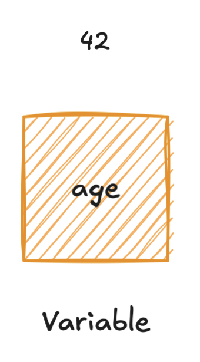
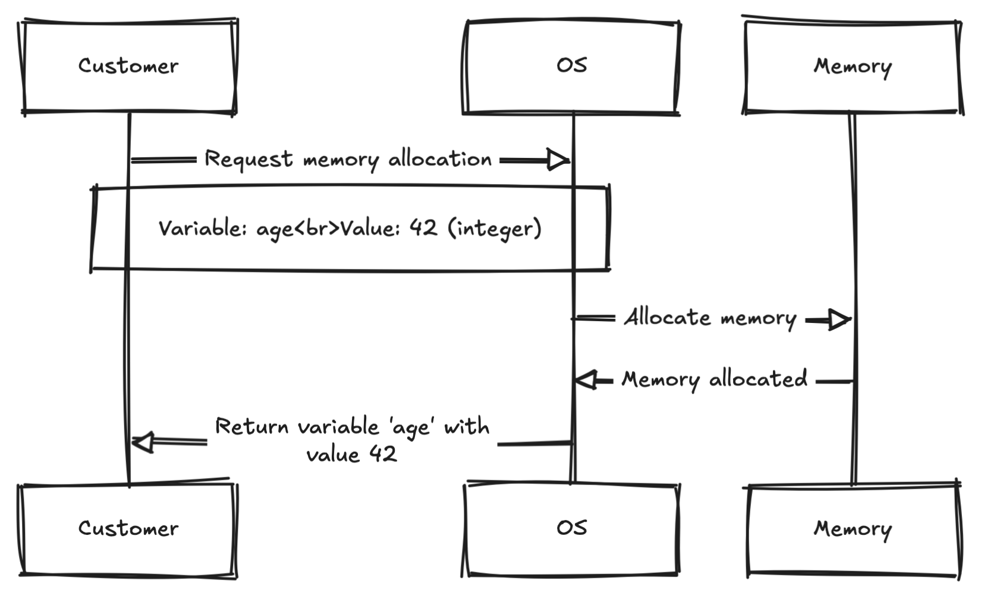

Prérequis:

- moteur JS / OS

## La théorie

Une variable est une boite qui contient une quelques chose.



On demande a notre ordinateur de nous donner une zone mémoire temporaire afin d'y stocker quelques chose.


Il n'est pas important de comprendre tout le process a 100%, mais cela permet d'illustrer grossièrement le process

En Javascript, on va pouvoir stocker différents types de valeurs dans nos variables, elles sont classés en 2 catégories:

- Les primitives
- Les objects

Les valeurs primitives sont a la base du langages d'ou sont nom primitive.

- strings (chaîne de caractères)
- number (nombre)
- bigint (très gros nombre)
- boolean (vrai ou faux)
- undefinied (non défini)
- null
- symbole

Nous rentrerons plus en détails dans les cours suivants afin que tu comprenne vraiment chaque notion qui se cache derrière ces termes.

### Mais dans tous ca, comment on declare une variable en JS ?

La syntax se compose de 3 parties (nous verrons qu'il en existe une 4ème plus tard)


### Mot clès ou `keyword`

est un mot réserver par le langage pour executer une action, par exemple: `let` permet de dire que l'on souhaite reserver un espace mémoire, que l'on pourra modifié par la suite. Liste des différents keywords en JS [`mot clés`](https://developer.mozilla.org/en-US/docs/Web/JavaScript/Reference/Lexical_grammar#keywords)

### `Nom de la variable`

Sert à différencier les variables, le nom peut être composer de caractère et chiffre, cependant les espaces ne sont pas autorisé. Il n'est pas possible d'avoir deux variables portant le même nom.

🚨 Le nom des variables est sensible à la casse.

```Javascript
let monNom = "dupont" // ✅ valide
let monnom = "dupont" // ✅ valide
let monAge = 42 // ✅ valide
let monAge = 42 // ❌ invalide, une autre variable existe avec le meme nom
let mon nom = "une erreur" // ❌ invalide, pas d'espace
```

Exemple:

```Javascript
let cat = "Garfield";
```

```Javascript
let name = "John"; // ✅ valide
let let = "async"; // ❌ invalide
const age = 42; // ✅ valide

var address = "127.0.0.1" // ✅ valide
```

### `let`

Avec `let` tu peux déclarer une variable dans laquelle tu peux changer sa valeur !
C'est à dire que son contenue peu changer !

```Javascript
let name = "Alexis"

name = "Valentin"  // ✅ valide
```

### `const`

C'est un autre moyen de déclarer des variables, const est le diminutif de constante (qui ne change pas). Il n'est donc pas possible de modifier la valeur qui y est associé.

```javascript
const name = "Alexis";
name = "Valentin"; // ❌ invalide
```

### `var` (déprécié)

Tu verras peut-être des variables déclarer avec le mot clés `var` mais il n'est plus recommendé de l'utiliser.

Mais il avait la meme utilisation que `let`.

### Un peu de pratique

Exercice:

1. Change la valeur de la variable afin que le test soit vert
2. Déclare une variable `name` qui prendra ton nom puis une variable `age`.
